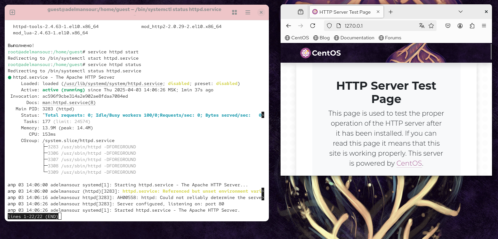
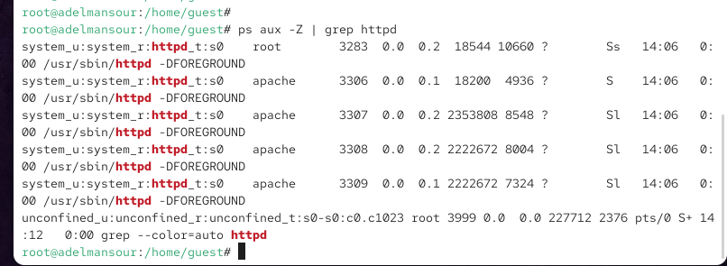
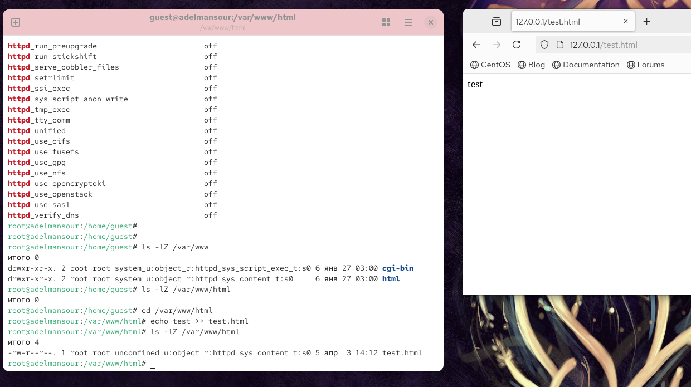
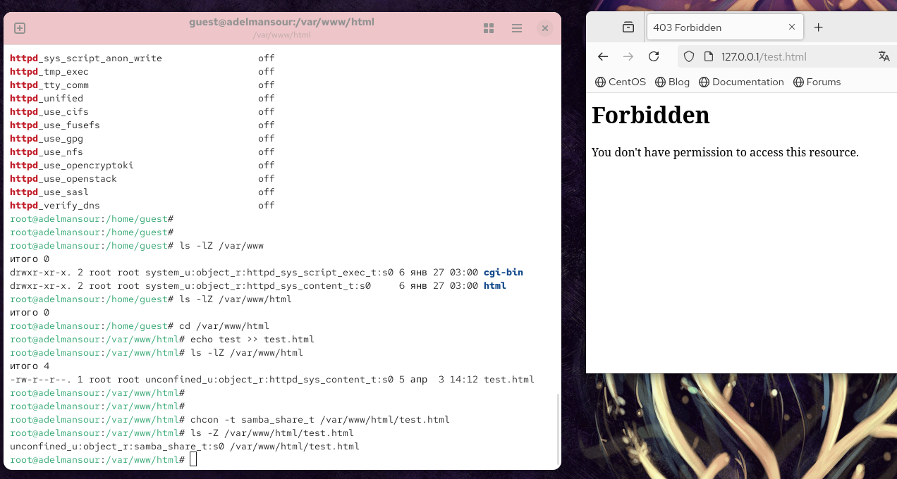
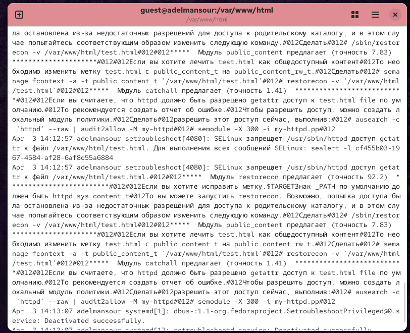
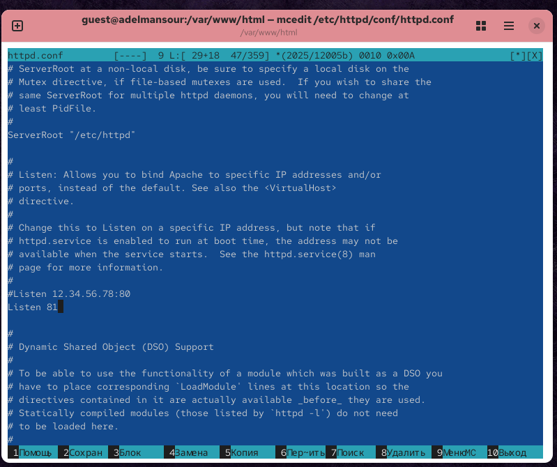
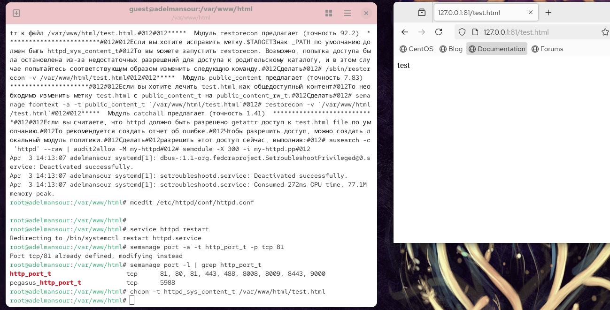

---
# Front matter
title: "Отчёт по лабораторной работе №6"
subtitle: "Знакомство с SELinux"
author: "Адель Мансур"

# Generic otions
lang: ru-RU
toc-title: "Содержание"

# Bibliography
bibliography: bib/cite.bib
csl: pandoc/csl/gost-r-7-0-5-2008-numeric.csl

# Pdf output format
toc: true # Table of contents
toc_depth: 2
lof: true # List of figures
fontsize: 12pt
linestretch: 1.5
papersize: a4
documentclass: scrreprt
## I18n
polyglossia-lang:
  name: russian
  options:
	- spelling=modern
	- babelshorthands=true
polyglossia-otherlangs:
  name: english
### Fonts
mainfont: PT Serif
romanfont: PT Serif
sansfont: PT Sans
monofont: PT Mono
mainfontoptions: Ligatures=TeX
romanfontoptions: Ligatures=TeX
sansfontoptions: Ligatures=TeX,Scale=MatchLowercase
monofontoptions: Scale=MatchLowercase,Scale=0.9
## Biblatex
biblatex: true
biblio-style: "gost-numeric"
biblatexoptions:
  - parentracker=true
  - backend=biber
  - hyperref=auto
  - language=auto
  - autolang=other*
  - citestyle=gost-numeric
## Misc options
indent: true
header-includes:
  - \linepenalty=10 # the penalty added to the badness of each line within a paragraph (no associated penalty node) Increasing the value makes tex try to have fewer lines in the paragraph.
  - \interlinepenalty=0 # value of the penalty (node) added after each line of a paragraph.
  - \hyphenpenalty=50 # the penalty for line breaking at an automatically inserted hyphen
  - \exhyphenpenalty=50 # the penalty for line breaking at an explicit hyphen
  - \binoppenalty=700 # the penalty for breaking a line at a binary operator
  - \relpenalty=500 # the penalty for breaking a line at a relation
  - \clubpenalty=150 # extra penalty for breaking after first line of a paragraph
  - \widowpenalty=150 # extra penalty for breaking before last line of a paragraph
  - \displaywidowpenalty=50 # extra penalty for breaking before last line before a display math
  - \brokenpenalty=100 # extra penalty for page breaking after a hyphenated line
  - \predisplaypenalty=10000 # penalty for breaking before a display
  - \postdisplaypenalty=0 # penalty for breaking after a display
  - \floatingpenalty = 20000 # penalty for splitting an insertion (can only be split footnote in standard LaTeX)
  - \raggedbottom # or \flushbottom
  - \usepackage{float} # keep figures where there are in the text
  - \floatplacement{figure}{H} # keep figures where there are in the text
---

# Цель работы

Развить навыки администрирования ОС Linux. Получить первое практическое знакомство с технологией SELinux. Проверить работу SELinx на практике совместно с веб-сервером Apache

# Выполнение лабораторной работы

## Подготовка

1. Установили httpd

2. Задали имя сервера

3. Открыли порты для работы с протоколом http

## Изучение механики SetUID

1. Войдите в систему с полученными учётными данными и убедитесь, что SELinux работает в режиме enforcing политики targeted с помощью команд getenforce и sestatus. 

2. Обратитесь с помощью браузера к веб-серверу, запущенному на вашем компьютере, и убедитесь, что последний работает: service httpd status или /etc/rc.d/init.d/httpd status Если не работает, запустите его так же, но с параметром start.

{ #fig:001 width=70% height=70%}

3. Найдите веб-сервер Apache в списке процессов, определите его контекст безопасности и занесите эту информацию в отчёт. Например, можно использовать команду ps auxZ | grep httpd или ps -eZ | grep httpd 

{ #fig:002 width=70% height=70%}

4.	Посмотрите текущее состояние переключателей SELinux для Apache с помощью команды sestatus -bigrep httpd Обратите внимание, что многие из них находятся в положении «off». 

{ #fig:003 width=70% height=70%}

5. Посмотрите статистику по политике с помощью команды seinfo, также определите множество пользователей, ролей, типов.

6. Определите тип файлов и поддиректорий, находящихся в директории /var/www, с помощью команды ls -lZ /var/www. В поддиректориях могут располагаться системные скрипты и контент для http.

7. Определите тип файлов, находящихся в директории /var/www/html: ls -lZ /var/www/html. В директории изначально нет файлов.

8. Определите круг пользователей, которым разрешено создание файлов в директории /var/www/html. Создавать файлы может только root.

9. Создайте от имени суперпользователя (так как в дистрибутиве после установки только ему разрешена запись в директорию) html-файл /var/www/html/test.html следующего содержания:  Test

10. Проверьте контекст созданного вами файла. Занесите в отчёт контекст, присваиваемый по умолчанию вновь созданным файлам в директории /var/www/html.

11. Обратитесь к файлу через веб-сервер, введя в браузере адрес http://127.0.0.1/test.html. Убедитесь, что файл был успешно отображён.

{ #fig:004 width=70% height=70%}

12. Изучите справку man httpd_selinux и выясните, какие контексты файлов определены для httpd. Сопоставьте их с типом файла test.html. Проверить контекст файла можно командой ls -Z. ls -Z /var/www/html/test.html. Основным контекстом является httpd_sys_content_t, его мы и увидели в выводе команды.

13. Измените контекст файла /var/www/html/test.html с httpd_sys_content_t на любой другой, к которому процесс httpd не должен иметь доступа, например, на samba_share_t: chcon -t samba_share_t /var/www/html/test.html ls -Z /var/www/html/test.html После этого проверьте, что контекст поменялся.

14. Попробуйте ещё раз получить доступ к файлу через веб-сервер, введя в браузере адрес http://127.0.0.1/test.html. Вы должны получить сообщение об ошибке: Forbidden You don't have permission to access /test.html on this server. При изменении контекста файл стал считаться чужим для http и программа не может его прочитать.

{ #fig:005 width=70% height=70%}

15. Проанализируйте ситуацию. Почему файл не был отображён, если права доступа позволяют читать этот файл любому пользователю? ls -l /var/www/html/test.html Просмотрите log-файлы веб-сервера Apache. Также просмотрите системный лог-файл: tail /var/log/messages Если в системе окажутся запущенными процессы setroubleshootd и audtd, то вы также сможете увидеть ошибки, аналогичные указанным выше, в файле /var/log/audit/audit.log. Проверьте это утверждение самостоятельно.

{ #fig:006 width=70% height=70%}

16. Попробуйте запустить веб-сервер Apache на прослушивание ТСР-порта 81 (а не 80, как рекомендует IANA и прописано в /etc/services). Для этого в файле /etc/httpd/httpd.conf найдите строчку Listen 80 и замените её на Listen 81.

{ #fig:007 width=70% height=70%}

17. Выполните перезапуск веб-сервера Apache. Произошёл сбой? Поясните почему?
Сбой не происходит, порт 81 уже вписан в разрешенные

18. Проанализируйте лог-файлы: tail -nl /var/log/messages Просмотрите файлы /var/log/http/error_log, /var/log/http/access_log и /var/log/audit/audit.log и выясните, в каких файлах появились записи.

19. Выполните команду semanage port -a -t http_port_t -р tcp 81 После этого проверьте список портов командой semanage port -l | grep http_port_t Убедитесь, что порт 81 появился в списке.

20. Попробуйте запустить веб-сервер Apache ещё раз.

21. Верните контекст httpd_sys_cоntent__t к файлу /var/www/html/ test.html: chcon -t httpd_sys_content_t /var/www/html/test.html После этого попробуйте получить доступ к файлу через веб-сервер, введя в браузере адрес http://127.0.0.1:81/test.html. Вы должны увидеть содержимое файла — слово «test».

{ #fig:008 width=70% height=70%}

22. Исправьте обратно конфигурационный файл apache, вернув Listen 80.

23. Удалите привязку http_port_t к 81 порту: semanage port -d -t http_port_t -p tcp 81 и проверьте, что порт 81 удалён.

24. Удалите файл /var/www/html/test.html: rm /var/www/html/test.html

# Выводы

В процессе выполнения лабораторной работы мною были получены базовые навыки работы с технологией seLinux.

# Список литературы{.unnumbered}

1. [SELinux в CentOS](https://access.redhat.com/documentation/en-us/red_hat_enterprise_linux/6/html/security-enhanced_linux/index)
2. [Веб-сервер Apache](https://httpd.apache.org/)
